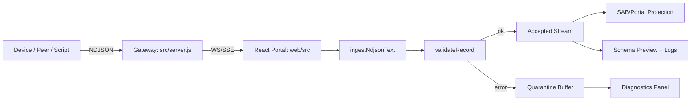
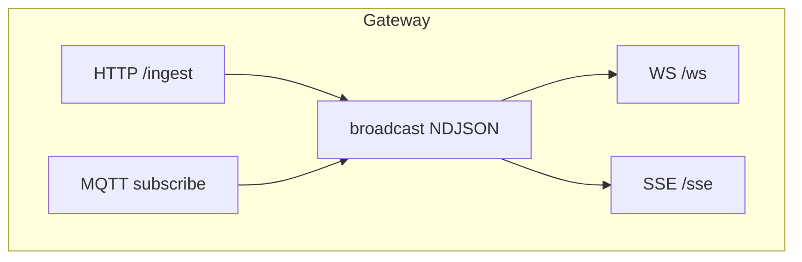
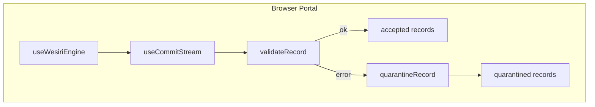

# Architecture Diagram

This document captures the current runtime data paths and control boundaries for `matroid-modem` v0.1.

## 1) End-to-end ingest path



## 2) Protocol construction path

```mermaid
flowchart LR
  A[Fano line id] --> M[semanticMerkle.ts]
  B[register_state 0..7] --> M
  C[hexagram_index 0..63] --> M
  M --> D[hexagram_bits[6]]
  D --> E[shell[240] = 6x40]
  E --> F[leaf_hash]
  F --> G[self_hash]
  G --> H[tx_frame / rx_frame / commit]
```

## 3) Gateway transport boundary



## 4) Browser runtime boundary



## 5) Current source-of-truth modules

- Protocol contract: `docs/RFC-0040-modem-protocol-v0.1.md`
- Mapping + hashing: `web/src/engine/semanticMerkle.ts`
- Validation: `web/src/engine/validateRecord.ts`
- Quarantine: `web/src/engine/quarantine.ts`
- Ingest funnel: `web/src/engine/useCommitStream.ts`
