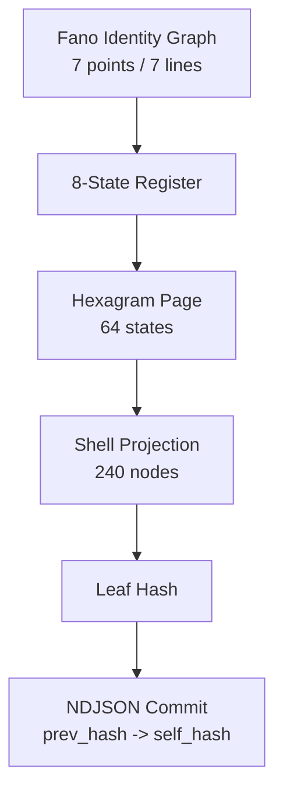

# Semantic Merkle Tree (7→8→64→240)

This document defines the deterministic projection stack used by the portal runtime:

- `7` Fano identity points
- `8` register states
- `64` hexagram pages (6-bit)
- `240` shell carrier nodes

## 1) Deterministic Projection Pipeline

```text
Identity triple (Fano line)
  -> register state (0..7)
  -> hexagram index (0..63)
  -> shell projection (240 nodes)
  -> leaf hash
```

## 2) Shell Partition Rule

`240 / 6 = 40`, so each hexagram line controls exactly 40 shell nodes.

```text
line 0 -> nodes   0.. 39
line 1 -> nodes  40.. 79
line 2 -> nodes  80..119
line 3 -> nodes 120..159
line 4 -> nodes 160..199
line 5 -> nodes 200..239
```

## 3) Merkle-Like Attribution Model

- **Core**: canonical semantic state (`fano + register + hexagram`).
- **Leaf**: hash of projected shell (`240` values).
- **Chain**: each event includes `prev_hash -> self_hash`.

This gives deterministic replay and decentralized verification without requiring global consensus.

## 4) Diagram (Mermaid)



## 5) Runtime Hooks

See `web/src/engine/semanticMerkle.ts` for:

- hexagram bit encoding
- 240-node shell projection
- deterministic leaf hashing
- event hash chaining
